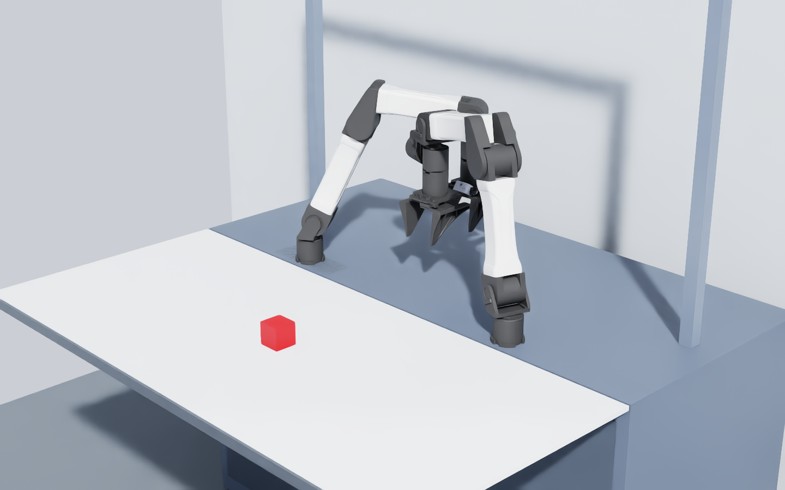
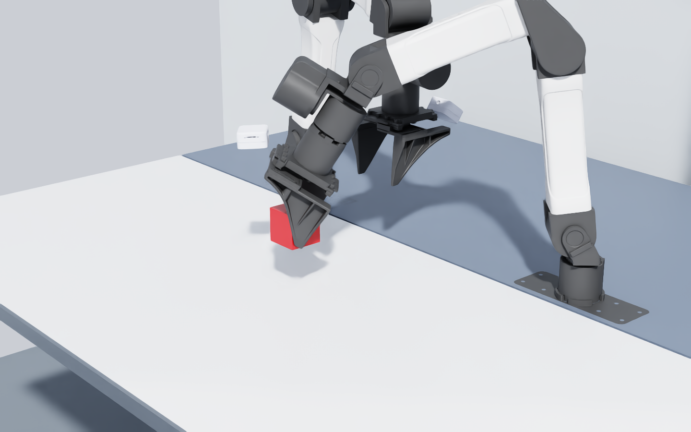

# YAM bimanual cube pickup

This environment loads both arms from the vendored YAM station asset, keeps
their source mount poses and mechanical properties, and asks the left arm to
pick up a red 5 cm cube from the robot's table. The right arm is present and
physically simulated, but the reference policy sends zero on every right-arm
action channel and task success forbids right-arm contact with the cube.





## Exact task contract

The cube origin is sampled independently and uniformly in the requested
20 cm by 20 cm square centered on the table:

```text
x in [0.50, 0.70] m
y in [-0.10, 0.10] m
z = 0.775 m
```

The tabletop center is `(0.600, 0.000, 0.745) m`, its size is
`0.595 x 1.300 x 0.010 m`, and its top is at `z = 0.750 m`. The YAM bases are
at `(0.2525, +0.3100, 0.7500) m` and
`(0.2525, -0.3100, 0.7500) m`. These values come directly from
[`robots/yam/source/station.xml`](../robots/yam/source/station.xml).

Success requires all of the following for 0.20 seconds:

- force-bearing contact with both left fingers;
- at least 50 mm of cube-center lift;
- no cube or left-arm contact with the play table;
- cube speed no greater than 0.15 m/s;
- no right-arm contact with the cube;
- exactly one cube pose write, at reset, and zero cube attachments.

Motion is also rejected if the cube jumps more than 35 mm in one 60 Hz
control interval. The episode limit is 15 seconds.

## Physics

The cube is a dynamic rigid body. After reset, gravity, collision, friction,
and the arm's force-limited articulation drives are the only mechanisms that
can move it. There is no fixed joint, attractor, pose animation, hidden lift
force, or post-reset cube pose write.

The main settings are:

| Quantity | Value |
| --- | ---: |
| PhysX solver | TGS |
| Physics rate | 240 Hz |
| Control rate | 60 Hz |
| Cube edge | 0.050 m |
| Cube mass | 0.13125 kg |
| Cube principal inertia | 5.46875e-5 kg m2 |
| Cube/table static, dynamic friction | 0.50, 0.40 |
| Finger/cube static, dynamic friction | 0.90, 0.75 |
| Restitution | 0.02 |
| Arm effort limits, joints 1-3 / 4-6 | 28 / 10 N m |
| Finger effort limit | 8 N per slide |

GPU rigid-body dynamics, continuous collision detection, patch friction,
32 cube position iterations, and four cube velocity iterations are enabled.
Contact force observations are computed from PhysX contact impulse divided by
the 1/240 s physics step. Unsafe right-arm and table contacts are accumulated
over all four physics steps in each control interval.

The source MJCF marks 22 arm bodies with `gravcomp="1"`. The adapter maps
that exact set to per-body gravity compensation; link 1 and the physical D405
body on each arm retain gravity. The arm bases are fixed to the world. Their
colliders extend through the cabinet surface because they represent a bolted
mount, so only those two base-to-cabinet collision pairs are filtered. All
moving-link, finger, table, and cube collision pairs remain active.

The YAM USD was generated with Isaac Sim 6.0.1, while the checked runtime is
Isaac Sim 5.1. The adapter makes two representation-only compatibility
changes: it gives nested rigid bodies world-transform-preserving reset stacks
and folds four source-massless TCP/camera marker bodies into their physical
parents. Runtime audits require zero initial transform change from both
operations and exactly two eight-DoF articulations.

## Action and observation API

The normalized action is a 14-vector in `[-1, 1]`:

```text
left linear XYZ, left angular XYZ, left aperture rate,
right linear XYZ, right angular XYZ, right aperture rate
```

Full scale is 0.18 m/s translation, 1.2 rad/s world-frame rotation, and
0.04 m/s aperture change. The observation contains cube pose and velocity,
both grasp-site poses and apertures, contact booleans and forces, the sampled
origin, and pose-write/attachment integrity counters.

`YamCubePickEnv` is a Gymnasium facade over the backend-independent action,
observation, reward, termination, and audit contract. Isaac-specific imports
remain in `IsaacYamCubePickBackend`, so task and policy tests run without
starting Isaac Sim.

## Run it

In PowerShell, point `ISAAC_SIM` at an Isaac Sim 5.1 installation:

```powershell
$env:ISAAC_SIM = "D:\Downloads\isaac-sim-standalone-5.1.0-windows-x86_64"
```

Launch a visible reference pickup:

```powershell
& "$env:ISAAC_SIM\python.bat" yam_cube_pick\run_isaac.py --gpu 0 --seed 3819
```

Run one headless episode and save the full audit and trajectory:

```powershell
& "$env:ISAAC_SIM\python.bat" yam_cube_pick\run_isaac.py `
  --headless --gpu 0 --seed 3819 `
  --output .runtime-cache\yam_cube_pick\seed_3819.json
```

Capture post-step motion frames without advancing physics during capture:

```powershell
& "$env:ISAAC_SIM\python.bat" yam_cube_pick\run_isaac.py `
  --headless --gpu 0 --seed 3819 `
  --capture-dir .runtime-cache\yam_cube_pick\reference_seed_3819 `
  --output .runtime-cache\yam_cube_pick\visual_seed_3819.json
```

Independently verify a saved artifact instead of trusting its top-level
`pass` field:

```powershell
python -m yam_cube_pick.verify_run `
  .runtime-cache\yam_cube_pick\seed_3819.json `
  --expected-seeds 3819
```

Run the pure contract tests:

```powershell
python -m pytest yam_cube_pick\tests -q
```

## Reference policy

The reference grasp keeps the finger-closing axis horizontal and tilts the
tool 32 degrees from vertical toward the cube. A controlled workspace probe
showed that the earlier vertical wrist pose was unreachable at the far
`+X/-Y` corner, while the tilted pose has exact inverse-kinematics solutions
at all four near-corner samples and the center.

The tilted YAM fingers do not pinch at the imported grasp marker. A collider
measurement found the midpoint of the two long inner boxes 25.6 mm radially
inward of that marker. The policy therefore shifts the commanded site
25.6 mm outward and places it 13.5 mm above the cube center, which is 1 mm
above the first collision-free height in the matched table-clearance sweep.
The arm waits until the measured grasp site is within 1 mm of that target,
then closes through contact and lifts along its tilted tool axis.

That 1 mm gate is evidence-selected rather than seed-specific. In a matched
seed-588 sweep, 4 mm and 2 mm gates entered closure too early and reached only
0.553 mm and 0.640 mm peak lift. The 1 mm and 0.5 mm gates reached 83.304 mm
and 83.419 mm. The 0.5 mm cell also raised peak finger-B normal load to
21.040 N versus 12.344 N at 1 mm, so the least restrictive successful 1 mm
gate was retained. The sweep controls complete initial physical state and is
saved in
[`evidence/alignment_gate_sweep_seed588.json`](evidence/alignment_gate_sweep_seed588.json).

The policy is a reproducible physical demonstration, not a claim of an
optimal learned policy. Its seven right-arm action channels are always zero.

## Qualification

The final same-source qualification passed all 25 episodes:

- 5/5 at four near-corner samples plus center;
- 20/20 for unselected seeds 0 through 19;
- sampled coordinates spanning x = 0.5016 to 0.6997 m and
  y = -0.0968 to 0.0988 m;
- physical lifts from 80.414 to 85.126 mm;
- success speeds from 0.063738 to 0.072452 m/s;
- all 29 named runtime checks true in every episode;
- zero attachments, zero post-reset pose writes, zero sampled right-arm
  actions, and no left-arm station/table force.

The 22-cell numerical campaign adds three bit-exact canonical repeats,
120/240/480 Hz temporal comparison, solver-iteration, contact-offset,
density, friction, restitution, solver, and CCD sensitivity, plus retained
zero-friction, 2.1 kg cube, and 200 mm verifier falsifications. All final
physical artifacts share execution-source SHA-256
`5ce65c1a57a32f922b5451f369c375cdadd81d31deb294b8902d97668216a718`.

Full trajectories, contact-point geometry, complete reset state, runtime
read-back, independent verifier summaries, fixed-time video, artifact hashes,
and reproduction commands are in [`evidence/`](evidence/). The compiled
physics dossier is
[`paper/yam_cube_pick_physics_report.pdf`](paper/yam_cube_pick_physics_report.pdf).

## Calibration boundary

Requested dimensions, station geometry, arm mount poses, cube sampling, and
the source YAM inertial/joint model are audited directly. The cube density,
friction, and restitution are explicit engineering priors because no
particular real cube specimen was supplied. They must be replaced with
measurements before claiming calibration to a named physical setup. The
current model is rigid-body contact; it does not model small elastic
deformation of the cube or finger pads.

The vendored YAM MJCF and meshes come from
[xdofai/yam_env](https://github.com/xdofai/yam_env) under the adjacent
[`robots/yam/LICENSE`](../robots/yam/LICENSE).

## Layout

- `specs.py`: dimensions, rates, material priors, and success thresholds.
- `api.py`: normalized action and backend interface.
- `task.py`: history-aware reward and strict success/failure logic.
- `env.py`: Gymnasium facade.
- `reference_policy.py`: left-only observable-state pickup demonstration.
- `isaac_backend.py`: scene construction, PhysX contacts, YAM control, audits.
- `run_isaac.py`: CLI runner, trajectory recorder, frame capture, source hash.
- `verify_run.py`: independent saved-artifact verifier.
- `analysis.py`: task-support and saved-trace analysis.
- `encode_video.py`: fixed-simulation-time H.264 encoder and decode audit.
- `probes/`: asset, reset, Jacobian, workspace, grasp, and numerical studies.
- `calibration/`: JSON Schema, raw-data template, and physical protocol.
- `paper/`: generated figures, 26-page dossier, and page-level visual QA.
- `evidence/`: final runs, campaign, video, verification, and hash manifests.
- `tests/`: 31 pure contract, calibration, task, policy, environment,
  analysis, and verifier tests.
